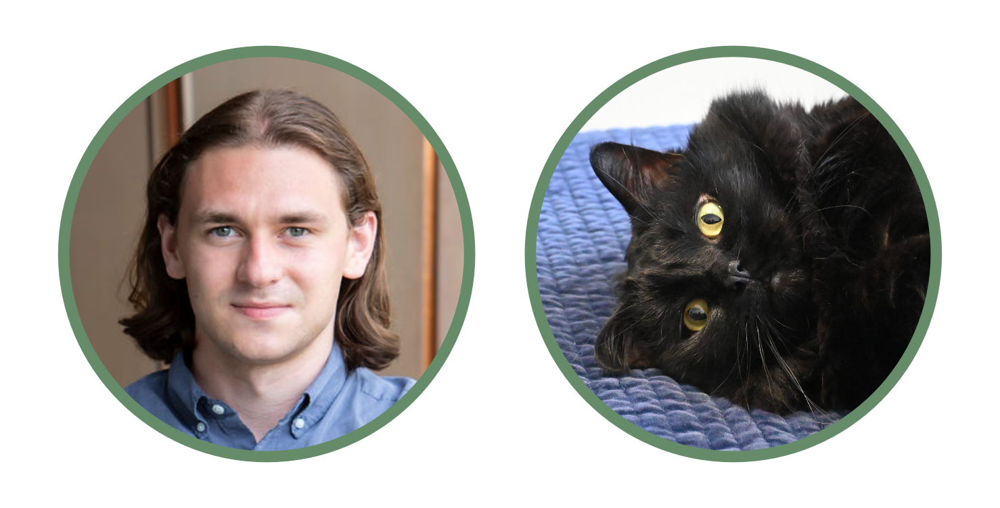

What's My Deal?
===============

   *Drew Honson (he/him) and Tarot (cat)*

I'm a molecular biologist who loves hypothesis-driven research and primarily ends up doing methods development. So it goes. I grew up in Minnesota and had a classical education from elementary to high school. Essentially this means I had stellar humanities and middling science classes. For a long time I wanted to be both a novelist and a scientist. I still love reading, but I haven't written fiction in a long time.

I spent a lot of time in the woods as a kid, and every year my dad would take me to the Boundary Waters Canoe Area near the Canadian border. I had a Kodak EasyShare camera that I won in a paper airplane throwing contest, and I tried to photograph as many insects and birds as I could. I started an insect collection, but killing the bugs made me sad, and I never had the heart to expand it much. Despite this discomfort, my interest in the diversity of life has led me to study many model organisms: axolotls, mice, fruit flies, and chickens. I primarily work in cell culture models now, but I'd like to return to whole organisms in the future. 

My motivation for creating this site is that I've spent a lot of time optimizing common laboratory techniques that are unlikely to be published in as much detail as I can give here. I hope that these pages will help preserve that knowledge for me, and shorten the optimization process for other scientists.

For now, I'm finishing up my PhD studying the roles of auxiliary U1 snRNP binding factors in regulating transcription. I live in Los Angeles with my fiancée Natalie and my cat Tarot.  
