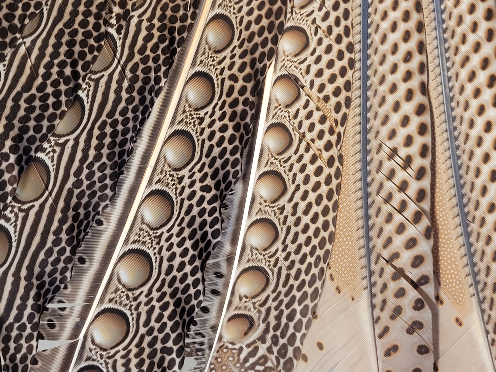

.. dhonson_research documentation master file, created by
   sphinx-quickstart on Wed Aug  9 13:45:01 2023.
   You can adapt this file completely to your liking, but it should at least
   contain the root `toctree` directive.

Introduction
============

My name is Drew Honson. I am a fifth year graduate student in the laboratory of Mitch Guttman at Caltech. I am creating this website to share wet lab protocols and software packages for molecular biology that I have written. My hope is to provide inexpensive replacements to common kits and well-documented code to support reproducible reagent generation and data analysis.

   *Argus bird plumage. Taken at the Kunsthistorisches Museum Vienna*

.. toctree::
   :maxdepth: 1
   :caption: Laboratory Protocols

   laboratoryprotocols/dnalibrary
   laboratoryprotocols/rnalibrary
   laboratoryprotocols/rnamini
   laboratoryprotocols/silane

.. toctree::
   :maxdepth: 1
   :caption: Software Packages

   softwarepackages/rapprobesdemo.ipynb
 
.. toctree::
   :maxdepth: 1
   :caption: About

   aboutme/whoami
   aboutme/sitedesign 
