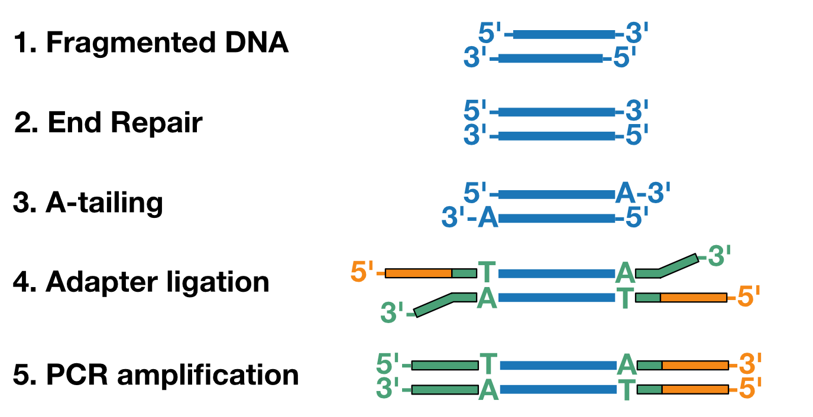
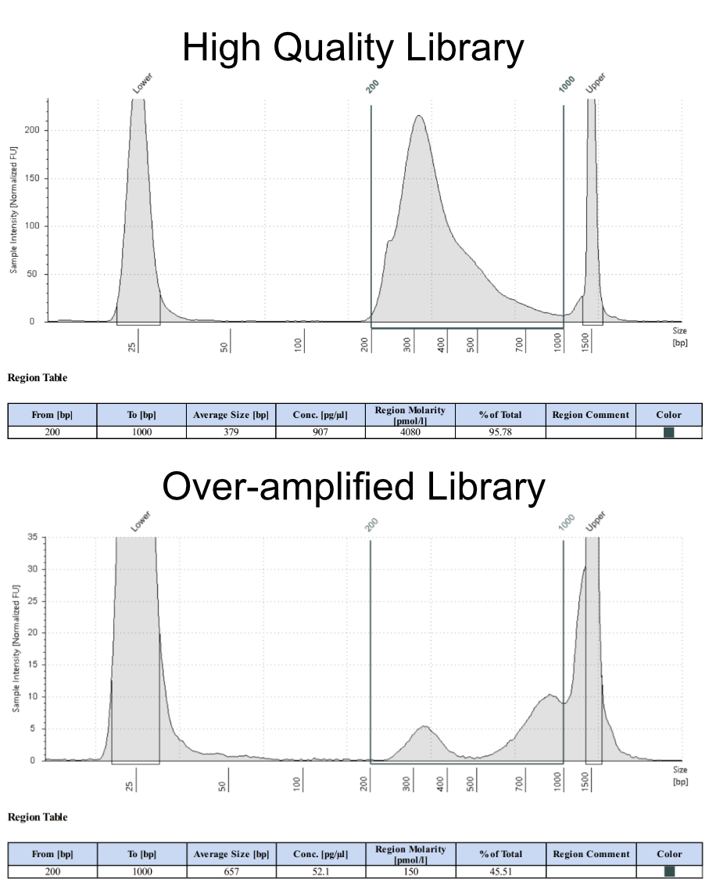

DNA Library Preparation
=======================

This protocol describes how to make dual-indexed Illumina sequencing libraries from fragmented DNA (e.g. ChIP-seq or RAP-DNA libraries). It is an adaptation of the NEBNext DNA library preparation kit and uses some of the same components. The resultant libraries should be sequenced with settings for Illumina's Nextera XT kit.

   *Schematic of library prep workflow. i5 is on the left side (green) while i7 is on the right (orange).*

.. raw:: html

    

Materials
-----------------------

In-House Reagents
^^^^^^^^^^^^^^^^^

`Buffer calculator <https://docs.google.com/spreadsheets/d/1XsZBwDW9_-XgDzVVm5SwegziqMZ3Bov1/edit?usp=sharing&ouid=110781881215035430006&rtpof=true&sd=true>`_

10x Annealing Buffer

   100mM Tris-HCl, pH 7.5

   2M LiCl

Wash Buffer 2

   80% ethanol

   100mM NaCl   

   10mM Tris-HCl, pH7.5

Commercial Reagents
^^^^^^^^^^^^^^^^^^^

NEBNext End Repair Module

NEBNext 10x dA-Tailing Buffer

NEBNext Klenow Fragment (exo-)

NEB 2x Instant Sticky-End Master Mix

NEB 2x Q5 High-Fidelity 2x Master Mix

Zymo DNA Binding Buffer

Plastics and Beads
^^^^^^^^^^^^^^^^^^

SPRI beads, prewarmed to room temperature

Zymo IC Columns

Zymo Collection Tubes

Oligonucleotides
^^^^^^^^^^^^^^^^

Nextera XT i5i7 Y-adapt TOP: 

   /5Phos/GATCGGAAGAGCGTCGTGTAGGGAAAGAGTGT

Nextera XT  Y-adapt BOT: 

   GTGACTGGAGTTCAGACGTGT[GCTCTTCCGATC]T

Nextera XT i7 F and i5 R primers, 12.5µM mix (see Protocol Notes)

For Library Diagnostics
^^^^^^^^^^^^^^^^^^^^^^^

Qubit HS DNA kit or other high-sensitivity spectrophotometer

TapeStation, Bioanalyzer, or other high sensitivity electrophoresis instrument

For Final Library Preparation
^^^^^^^^^^^^^^^^^^^^^^^^^^^^^

1-2% agarose gel

Zymo ADB Buffer

Adapter Annealing
-----------------

The Y-adapt TOP and BOT contain overhangs for the Nextera Illumina primers. Y-adapt TOP contains the i5 sequence while BOT contains the i7 sequence. The sequence in brackets in Broad i5i7 Y-adapt BOT anneals to Y-adapt TOP. After annealing, the product contains a 3'-T overhang for ligation to end-repaired and dA-tailed DNA fragments.

1. Y-adapter Annealing Reaction

   18µl 222µM Broad i5i7 Y-adapt TOP

   18µl 222µM Broad i5i7 Y-adapt BOT

   4µl 10x annealing buffer

2. Heat reactions to 95°C on a thermocycler, then ramp down to 25°C, 5°C decrease per 15sec.

3. Place the reactions on ice. Adapters are now at 100µM. Take an aliquot of the annealed adapter and dilute to 10µM using TE buffer or nuclease-free water. Store annealed adapter at -20°C.

End Repair 
----------

1. End Repair Reaction

   16.5µl dsDNA, fragmented to 100-1000bp (≤ 5µg)   

   2µl NEBNext End Repair Buffer

   1.5µl NEBNext End Repair Enzymes

2. Incubate 30min, 25°C.

3. Column clean the reaction.

   a. Add 5x volume (100µl) DNA binding buffer.

   b. Invert 5-10 times to mix then pop spin briefly.

   c. Transfer solution to a Zymo IC column. Spin >8000g, 15s.

   d. Discard flow through.

   e. Add 200µl DNA/RNA Wash Buffer. Spin >8000g, 15s.

   f. Discard flow through.

   g. Add 200µl DNA/RNA Wash Buffer. Spin >8000g, 15s.

   h. Transfer column to a clean 1.7mL tube.

   i. Add **16.5µl** water. Spin 8000-16,000g, 1min.

dA Tailing
----------

1. dA Tailing Reaction

   16.5µl end-repeaired DNA
   
   2µl NEBNext 10x dA Tailing Buffer

   1.5µl NEBNext Klenow exo-

2. Incubate 30min, 37°C.

3. Column clean the reaction.

   a. Add 5x volume (100µl) DNA binding buffer.

   b. Invert 5-10 times to mix then pop spin briefly.

   c. Transfer solution to a Zymo IC column. Spin >8000g, 15s.

   d. Discard flow through.

   e. Add 200µl DNA/RNA Wash Buffer. Spin >8000g, 15s.

   f. Discard flow through.

   g. Add 200µl DNA/RNA Wash Buffer. Spin >8000g, 15s.

   h. Transfer column to a clean 1.7mL tube.

   i. Add **14µl** water. Spin 8000-16,000g, 1min.

Adapter Ligation
----------------

1. Adapter Ligation Reaction

   14µl dA-tailed DNA
   
   1µl 10µM Y-adapter

   15µl 2x Instant Sticky-End Master Mix

2. Incubate 10min, 25°C.

3. SPRI clean to remove adapter.

   a. Add 1x volume room-temperature SPRI beads (30µl) to the reaction. Flick and pop-spin the tube 3 times to mix.

   b. Incubate 9min, room-temperature. Flick and pop-spin every 3min to mix.

   c. Place tube on magnetic rack and allow beads to fully clear, 2-5min.

   d. Remove supernatant.

   e. Add 150µl 80% ethanol. Remove tube from rack, rotate 180°, then place back in rack to pull beads through the ethanol to the opposite wall. Repeat rotation 2-3 times.

   f. Allow beads to separate completely and remove supernatant.

   g. Repeat steps e. and f. twice more for a total of 3 washes.

   h. After removing final ethanol wash, briefly pop-spin the tubes. Place on the magnet and use a P20 pipette to remove any residual ethanol.

   i. Dry beads 2-5min until they look matte.

   j. Resuspend beads in **50µl** nuclease-free water to elute. Magnetically pellet the beads and transfer the supernatant to a clean tube.

4. Repeat 1x SPRI clean in step 3 using 50µl room-temperature SPRI beads. This ensures that nearly all adapter is removed. Elute in **50µl** water. 22.5µl will be used for amplification, and the rest will be saved in case of over-amplification.

Library Amplification
---------------------

1. Library PCR Reaction

   22.5µl ligated DNA

   2.5µl 12.5µM i7 F x i5 R Broad Primers

   25µl 2x Q5 High-Fidelity Master Mix

2. Thermocycler Settings

   .. list-table::
     :widths: 25 25 25
     :header-rows: 1

     * - Temp (°C)
       - Time
       - Cycles
     * - 98
       - 15s
       - 1
     * - 98
       - 15s
       - 4
     * - 68
       - 15s
       - 
     * - 72
       - 30s
       - 
     * - 98
       - 15s
       - 3-9 (see Protocol Notes)
     * - 72
       - 1min
       - 
     * - 72
       - 1min
       - 1
     * - 4
       - forever
       - 

3. SPRI clean to remove primers.

   a. Add 1x volume room-temperature SPRI beads (50µl) to the reaction. Flick and pop-spin the tube 3 times to mix.

   b. Incubate 9min, room-temperature. Flick and pop-spin every 3min to mix.

   c. Place tube on magnetic rack and allow beads to fully clear, 2-5min.

   d. Remove supernatant.

   e. Add 150µl 80% ethanol. Remove tube from rack, rotate 180°, then place back in rack to pull beads through the ethanol to the opposite wall. Repeat rotation 2-3 times.

   f. Allow beads to separate completely and remove supernatant.

   g. Repeat steps e. and f. twice more for a total of 3 washes.

   h. After removing final ethanol wash, briefly pop-spin the tubes. Place on the magnet and use a P20 pipette to remove any residual ethanol.

   i. Dry beads 2-5min until they look matte.

   j. Resuspend beads in **13µl** nuclease-free water to elute. Magnetically pellet the beads and transfer the supernatant to a clean tube.

Library Diagnostics
-------------------

1. Measure concentration of library with Qubit High Sensitivity.

2. Measure size distribution by loading 1ng library on a HS D1000 TapeStation Tape or a HS DNA Bioanalyzer chip.

3. For standard DNA fragmentation, the library should show a unimodal distribution with an average size between 300-500bp and a tail to the right. Little if any DNA should have sizes greater than 1000bp. See the image below for an example of a high quality library, and one that has been over-amplified, resulting in a multimodal distribution. 

.. raw:: html

    

Final Library Preparation
-------------------------

Libraries should always be gel cut before loading on Illumina instruments to avoid primer contamination. Different Illumina instruments and flow cells require different concentrations of libraries, so always check the documentation of your specifc setup before proceeding.

In the future, I will add a more detailed guide on Illumina sequencing, but for the purpose of this protocol I will assume the user has already decided the number of reads they ultimately want for each library.

1. Pool libraries. Calculate the total femtomoles to pool by multiplying the desired final concentration by the final elution volume (13µl). Multiply this number by two to account for loss during clean-up. E.g. for a 1nM final library, multiply 1nM (fmol/µl) by 13µl by 2 to get 26fmol to pool).

2. Load pools on a 1-2% agarose gel. Keep one lane empty between ladders and individual pools. Run gel until ladder is clearly separated.

3. Using a razor blade, cut libraries between 200-1000bp. Transfer excised agarose to a clean 1.7mL tube.

.. figure:: images/22.10.03_LibPools.png
   :width: 600
   :alt: Pre- and post-gel cut libraries
   :align: center

   *Example libraries before and after gel-cutting.*

4. Tare a balance with an empty 1.7mL tube. Mass the excised agarose, then add 3µl Zymo ADB Buffer per 1mg agarose gel (e.g. 300µl ABD for a 100mg gel).

5. Heat gel at 50°C until fully dissolved, 3-5min.

6. Load up to 700µl dissolved gel onto a Zymo IC column in a collection tube. Spin >8000g, 15s. Discard flow through and repeat until entire sample has passed through the column.

7. Add 200µl DNA/RNA Wash Buffer. Spin >8000g, 15s.

8. Discard flow through.

9. Add 200µl DNA/RNA Wash Buffer. Spin >8000g, 1min to dry column.

10. Discard collection tube and transfer column to a clean 1.7mL tube.

11. Add 13µl nuclease-free water directly to the column. Incubate at room temperature 2-3min.

12. Spin 8000-16,000g, 1min to elute.

13. Quantify final gel-cut library using Qubit and Tapestation or Bioanalyzer as before.

Protocol Notes
--------------

* The sequences of Illumina's Nextera XT's primers are `publicly available. <https://dnatech.genomecenter.ucdavis.edu/wp-content/uploads/2013/06/illumina-adapter-sequences_1000000002694-00.pdf>`_ For convenience, I plan to post spreadsheets containing the sequences and adaptors that are compatible with IDT ordering on a GoogleDrive associated with this site.

* The number of cycles will vary dramatically depending on the type of experiment and amount of input DNA. Once a protocol is well-established a user can usually estimate an appropriate cycle number, but in early stages of using the protocol it is best to determine the optimal cycle number empirically. `This site <https://www.lexogen.com/amplification-of-rna-seq-libraries-the-correct-pcr-cycle-number/>`_ provides a good explanation of how to use qPCR for this purpose.

* An inexpensive supplier of SPRI beads in the United States is `Bulldog Bio. <https://www.bulldog-bio.com/product/cleanngs-beads/>`_ We have not noticed any performance differences between Bulldog Bio's and Beckman Coulter's products, but it is always best to check size selection using a DNA ladder when switching to a new product.

* If preparing many libraries simultaneously, it may be more convenient to perform Silane cleans rather than column cleans. Please refer to my Silane Cleaning Protocol for this adaptation.

Hazards and Waste Disposal
--------------------------

* Consult the Safety Data Sheet for any unfamiliar reagents and comply with local regulations regarding disposal of hazardous waste.

* Zymo DNA Binding Buffer contains guanidine hydrochloride (GuHCl), a powerful chaotrope. Always wear gloves and a labcoat when handling GuHCl. Do not open solid GuHCl outside of a fume hood and dispose of all liquid and solid waste in dedicated containers.

* Solutions containing GuHCl produce chlorine gas when mixed with bleach or other oxidizers. Be mindful of keeping these reagents separate.
