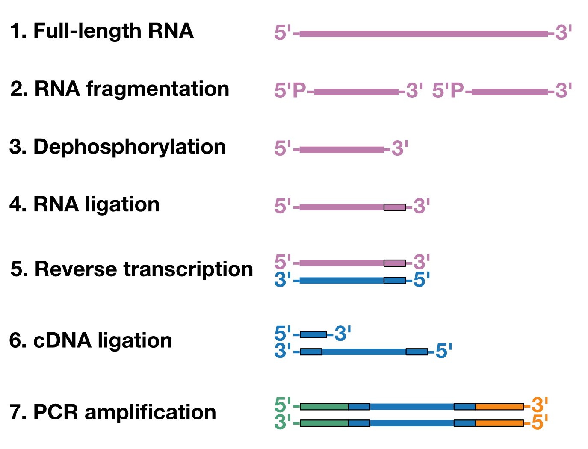
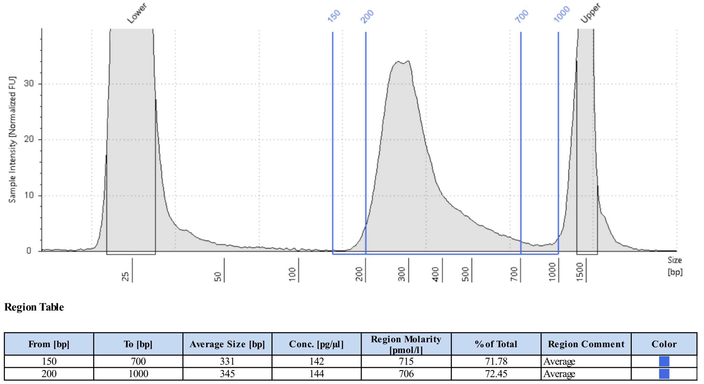

RNA Library Preparation
================================
This protocol describes how to generate Illumina sequencing libraries from total RNA. For already fragmented RNA (e.g. from eCLIP) the initial fragmentation step can be omitted. The earliest version of this protocol I can find is from Jesse Engreitz's 2013 paper `"The Xist lncRNA Exploits Three-Dimensional Genome Architecture to Spread Across the X Chromosome" <https://doi.org/10.1126/science.1237973>`_ but it has undergone many improvements over the subsequent years thanks to the work of numerous scientists in the Guttman lab. I'm presenting it here not to claim credit, but rather to increase distribution of the protocol. Additionally, the `DNA Library Preparation protocol <https://dhonson-lncrna.github.io/laboratoryprotocols/dnalibrary.html>`_ (which I did write) seems lonely without its RNA partner.

The workflow begins by fragmenting RNA to sizes between 100-1000bp and dephosphorylating the fragments. A common adapter is then ligated to the 3'-end of the RNA to allow for reverse transcription (RT) with a common primer. After RT, the cDNA has an i7 amplifiable 5'-end. The next step is ligate a splint to the 3'-end of the cDNA to permit amplification with an i5 primer. After removing excess splint, the RNA is ready for PCR amplification with Nextera XT primers.  

   *Schematic of library prep workflow. i5 is on the left side (green) while i7 is on the right (orange).*

.. raw:: html

    

Materials
---------

In-House Reagents
^^^^^^^^^^^^^^^^^

`Buffer calculator <https://docs.google.com/spreadsheets/d/14t-B8F6yNJ7xcO8kBrjlpoRxs6Zq3iMc/edit?usp=sharing&ouid=110781881215035430006&rtpof=true&sd=true>`_

10x Annealing Buffer

   100mM Tris-HCl, pH 7.5

   2M LiCl

GuSCN Lysis Buffer

   4M guanidinium thiocyanate (GuSCN)

   55mM Tris-HCl, pH 7.5

   25mM EDTA

   3% Triton X-100

Wash Buffer 2

   80% ethanol

   100mM NaCl

   10mM Tris-HCl, pH7.5

100% ethanol

80% ethanol

500mM EDTA, pH8.0

1M NaOH

1M HCl

DMSO

Commercial Reagents 
^^^^^^^^^^^^^^^^^^^

NEB 100mM ATP

NEB 10mM dNTP Mix

NEB 2x Instant Sticky-End Master Mix

NEB 2x Q5 High Fidelity Master Mix

NEB 50% PEG8000

NEB Exonuclease I

NEB T4 PNK and 10x buffer

NEB T4 High Concentration RNA Ligase and 10x buffer

ThermoFisher Fast AP and 10x buffer

ThermoFisher Maxima H Minus RT and 5x RT buffer

   The exact reverse transcriptase is flexible but it must **lack** RNaseH activity

ThermoFisher Ribolock (or other RNase inhibitor)

Zymo RNA Binding Buffer

Zymo RNA Prep Buffer

Plastics and Beads
^^^^^^^^^^^^^^^^^^

SPRI beads (Beckman Coulter or Bulldog Bio)

ThermoFisher Dynabeads MyOne Silane

Zymo IC Columns

Zymo Collection Tubes

Oligonucleotides
^^^^^^^^^^^^^^^^

RiL19 (RNA Ligation Adapter): 

   /5Phos/rArGrArUrCrGrGrArArGrArGrCrGrUrCrGrUrG/ddC

AR17 (RT Primer): 

   ACACGACGCTCTTCCGA

3Tr3 Splint TOP (cDNA ligation adapter): 

   CAGACGTGTGCTCTTCCGATCTNNNNNN/3SpC3/

3Tr3 Splint BOT (cDNA ligation adapter): 

   /5Phos/AGATCGGAAGAGCACACGTCTG

Nextera XT i7 F and i5 R primers, 12.5µM mix (see Protocol Notes)

For Library Diagnostics
^^^^^^^^^^^^^^^^^^^^^^^

Qubit HS DNA kit or other high-sensitivity spectrophotometer

TapeStation, Bioanalyzer, or other high sensitivity electrophoresis instrument

For Final Library Preparation
^^^^^^^^^^^^^^^^^^^^^^^^^^^^^

1-2% agarose gel

Zymo ADB Buffer

Adapter Annealing
-----------------

3Tr3 splint adds a 3'-overhang for the Nextera Illumina i5 primer set following ligation to cDNA.

1. 3Tr3 Annealing Reaction

   18µl 100µM 3Tr3 Splint TOP

   18µl 100µM 3Tr3 Splint BOT

   4µl 10x annealing buffer

2. Heat reactions to 95°C on a thermocycler, then ramp down to 25°C, 5°C decrease per 15sec.

3. Place the reactions on ice. Adapters are now at 45µM. Take an aliquot of the annealed adapter and dilute to 4.5µM using TE buffer or nuclease-free water. Store annealed adapter at -20°C.

Fragmentation and End Repair
----------------------------------

1. RNA Fragmentation Mix
   
   25ng-1µg RNA

   2µl 10x Fast AP Buffer

   Water to 18µl

2. Heat 91°C, 2min30s then cool to 4°C.

3. Add 1µl Fast AP and 1µl RNase inhibitor. Incubate 10min, 37°C.

4. Dephosphorylation Reaction

   20µl Fast AP reaction

   3µl 10x T4 PNK Buffer

   3µl T4 PNK

   4µl water

5. Incubate 10min, 37°C.

6. Column clean the reaction.

   a. Add 2x volume (60µl) RNA binding buffer.

   b. Add 1x volume (90µl) 100% ethanol.

   c. Invert 5-10 times to mix then pop spin briefly.

   d. Transfer solution to a Zymo IC column. Spin >8000g, 15s.

   e. Discard flow through.

   f. Add 400µl RNA Prep Buffer. Spin >8000g, 15s.

   g. Discard flow through.

   h. Add 500µl Wash Buffer 2. Spin >8000g, 15s.

   i. Discard flow through.

   j. Add 500µl Wash Buffer 2. Spin >8000g, 15s.

   k. Transfer column to a clean 1.7mL tube.

   l. Add **12µl** water. Spin 8000-16,000g, 1min.

RNA Ligation
------------

1. Mix 1.5µl DMSO and 1µl 20µM RNA Ligation Adapter.

2. Add 10µl fragmented and end repaired RNA to DMSO/adapter mix.

3. Heat 2min, 65°C then cool to 4°C.

4. Prepare Ligation Master Mix. After mixing, mix the reaction by flicking the tube until it splits into many droplets. Pop-spin the tube to gather the liquid. Repeat this 4-5 times to thoroughly mix. This step is essential due to the viscosity of PEG8000.

   2µl 10x T4 RNA Ligase Buffer

   0.2µl 100mM ATP

   6µl 50% PEG8000, pre-warmed to 37°C

   0.3µl RNase inhibitor

   0.3µl T4 High Concentration RNA Ligase

5. Add 8.8µl Ligation Master Mix to 12.5µl RNA/adapter mix.

6. Mix reaction by flicking and spinnning as done with the master mix.

7. Add an additional 1µl T4 High Concentration RNA Ligase. Mix reaction by flicking and spinning.

8. Incubate 1h15m, 25°C, 1600rpm shaking (1min ON, 5min OFF)

9. Clean using Silane beads. For a more detailed description, see `Silane Nucleic Acid Purification. <https://dhonson-lncrna.github.io/laboratoryprotocols/silane.html>`_

   a. Wash 12µl Silane beads per sample 3 times in 500µl GuSCN Lysis Buffer minimum, or 500µl GuSCN Lysis buffer per 120µl beads.

   b. After removing final wash, resuspend beads in 60µl GuSCN Lysis Buffer per sample.

   c. Add 60µl beads to each sample. Pipette up and down to mix.

   d. Incubate 1min, room temperature.

   e. Add 50µl 100% ethanol. Pipette up and down to mix.

   f. Incubate 3min, room temperature.

   g. Place tubes on magnetic rack and wait until solution clears.

   e. Remove supernatant. Wash beads three times with 150µl 80% ethanol if using strip tubes, or 250µl 80% ethanol if using 1.7mL tubes.

   f. After removing final wash, pop-spin then place the tube back on the magnet. Use a P20 pipette to remove any residual ethanol.

   g. Dry the beads 5-10min until they look matte.

   h. Resuspend the beads in **13µl** nuclease-free water to elute. 

Reverse Transcription
---------------------

1. Annealing Reaction

   12.5µl RNA sample
   
   1µl 5µM AR17

   1µl 10mM dNTPs

2. Heat 2min, 65°C then cool to 4°C.

3. Add 5.5µl RT Master Mix.

   4µl 5x Maxima RT Buffer

   1µl Maxima RT RNaseH Minus

   0.5µl RNase inhibitor

4. Incubate 30min, 50°C then cool to 4°C.

5. Add 4µl Exonuclease I to digest excess AR17. Incubate 15min, 37°C.

6. Add 1µl 0.5M EDTA to inactivate Exonuclease I.

7. Place on ice for 3min.

8. Add 2.5µl 1M NaOH.

9. Heat 6min, 80°C to degrade RNA, then cool to 4°C.

10. Add 2.5µl 1M HCl to neutralize base.

11. Clean using Silane beads.

   a. Wash 12µl Silane beads per sample 3 times in 500µl GuSCN Lysis Buffer minimum, or 500µl GuSCN Lysis buffer per 120µl beads.

   b. After removing final wash, resuspend beads in 90µl GuSCN Lysis Buffer per sample.

   c. Add 90µl beads to each sample. Pipette up and down to mix.

   d. Incubate 1min, room temperature.

   e. Add 75µl 100% ethanol. Pipette up and down to mix.

   f. Incubate 3min, room temperature.

   g. Place tubes on magnetic rack and wait until solution clears.

   e. Remove supernatant. Wash beads three times with 150µl 80% ethanol if using strip tubes, or 250µl 80% ethanol if using 1.7mL tubes.

   f. After removing final wash, pop-spin then place the tube back on the magnet. Use a P20 pipette to remove any residual ethanol.

   g. Dry the beads 5-10min until they look matte.

   h. Resuspend the beads in 13µl nuclease-free water to elute.

cDNA Splint Ligation
--------------------

1. Ligation Reaction

   2µl 4.5µM 3Tr3 Splint

   13µl cDNA

   15µl 2x Instant Sticky-End Master Mix 

2. Incubate 30min, 25°C

3. SPRI clean to remove adapter.

   a. Add 1x volume room-temperature SPRI beads (30µl) to the reaction. Flick and pop-spin the tube 3 times to mix.

   b. Incubate 9min, room-temperature. Flick and pop-spin every 3min to mix.

   c. Place tube on magnetic rack and allow beads to fully clear, 2-5min.

   d. Remove supernatant.

   e. Add 150µl 80% ethanol. Remove tube from rack, rotate 180°, then place back in rack to pull beads through the ethanol to the opposite wall. Repeat rotation 2-3 times.

   f. Allow beads to separate completely and remove supernatant.

   g. Repeat steps e. and f. twice more for a total of 3 washes.

   h. After removing final ethanol wash, briefly pop-spin the tubes. Place on the magnet and use a P20 pipette to remove any residual ethanol.

   i. Dry beads 2-5min until they look matte.

   j. Resuspend beads in **50µl** nuclease-free water to elute. Magnetically pellet the beads and transfer the supernatant to a clean tube.

Library Amplification
---------------------

1. Library PCR Reaction

   22.5µl ligated cDNA

   2.5µl 12.5µM i7 F x i5 R Broad Primers

   25µl 2x Q5 High-Fidelity Master Mix

2. Thermocycler Settings

   .. list-table::
     :widths: 25 25 25
     :header-rows: 1

     * - Temp (°C)
       - Time
       - Cycles
     * - 98
       - 15s
       - 1
     * - 98
       - 15s
       - 4
     * - 68
       - 15s
       - 
     * - 72
       - 30s
       - 
     * - 98
       - 15s
       - 3-9 (see Protocol Notes)
     * - 72
       - 1min
       - 
     * - 72
       - 1min
       - 1
     * - 4
       - forever
       - 

3. SPRI clean to remove primers.

   a. Add 1x volume room-temperature SPRI beads (50µl) to the reaction. Flick and pop-spin the tube 3 times to mix.

   b. Incubate 9min, room-temperature. Flick and pop-spin every 3min to mix.

   c. Place tube on magnetic rack and allow beads to fully clear, 2-5min.

   d. Remove supernatant.

   e. Add 150µl 80% ethanol. Remove tube from rack, rotate 180°, then place back in rack to pull beads through the ethanol to the opposite wall. Repeat rotation 2-3 times.

   f. Allow beads to separate completely and remove supernatant.

   g. Repeat steps e. and f. twice more for a total of 3 washes.

   h. After removing final ethanol wash, briefly pop-spin the tubes. Place on the magnet and use a P20 pipette to remove any residual ethanol.

   i. Dry beads 2-5min until they look matte.

   j. Resuspend beads in **13µl** nuclease-free water to elute. Magnetically pellet the beads and transfer the supernatant to a clean tube.

Library Diagnostics
-------------------

1. Measure concentration of library with Qubit High Sensitivity.

2. Measure size distribution by loading 1ng library on a HS D1000 TapeStation Tape or a HS DNA Bioanalyzer chip.

3. For standard RNA fragmentation, the library should show a unimodal distribution with an average size between 300-500bp and a tail to the right. For methods with high temperature washes (e.g. CLAP) the average sizes may be smaller. Little if any DNA should have sizes greater than 1000bp. See the image below for an example of a typical library. 

.. raw:: html

    

Final Library Preparation
-------------------------

Libraries should always be gel cut before loading on Illumina instruments to avoid primer contamination. Different Illumina instruments and flow cells require different concentrations of libraries, so always check the documentation of your specifc setup before proceeding.

In the future, I will add a more detailed guide on Illumina sequencing, but for the purpose of this protocol I will assume the user has already decided the number of reads they ultimately want for each library.

1. Pool libraries. Calculate the total femtomoles to pool by multiplying the desired final concentration by the final elution volume (13µl). Multiply this number by two to account for loss during clean-up. E.g. for a 1nM final library, multiply 1nM (fmol/µl) by 13µl by 2 to get 26fmol to pool).

2. Load pools on a 1-2% agarose gel. Keep one lane empty between ladders and individual pools. Run gel until ladder is clearly separated.

3. Using a razor blade, cut libraries between 200-1000bp. Transfer excised agarose to a clean 1.7mL tube.

.. figure:: images/22.10.03_LibPools.png
   :width: 600
   :alt: Pre- and post-gel cut libraries
   :align: center

   *Example libraries before and after gel-cutting.*

4. Tare a balance with an empty 1.7mL tube. Mass the excised agarose, then add 3µl Zymo ADB Buffer per 1mg agarose gel (e.g. 300µl ABD for a 100mg gel).

5. Heat gel at 50°C until fully dissolved, 3-5min.

6. Load up to 700µl dissolved gel onto a Zymo IC column in a collection tube. Spin >8000g, 15s. Discard flow through and repeat until entire sample has passed through the column.

7. Add 200µl DNA/RNA Wash Buffer. Spin >8000g, 15s.

8. Discard flow through.

9. Add 200µl DNA/RNA Wash Buffer. Spin >8000g, 1min to dry column.

10. Discard collection tube and transfer column to a clean 1.7mL tube.

11. Add 13µl nuclease-free water directly to the column. Incubate at room temperature 2-3min.

12. Spin 8000-16,000g, 1min to elute.

13. Quantify final gel-cut library using Qubit and Tapestation or Bioanalyzer as before.

Protocol Notes
--------------

* The sequences of Illumina's Nextera XT's primers are `publicly available. <https://dnatech.genomecenter.ucdavis.edu/wp-content/uploads/2013/06/illumina-adapter-sequences_1000000002694-00.pdf>`_ For convenience, I plan to post spreadsheets containing the sequences and adaptors that are compatible with IDT ordering on a GoogleDrive associated with this site.

* The number of cycles will vary dramatically depending on the type of experiment and amount of input DNA. Once a protocol is well-established a user can usually estimate an appropriate cycle number, but in early stages of using the protocol it is best to determine the optimal cycle number empirically. `This site <https://www.lexogen.com/amplification-of-rna-seq-libraries-the-correct-pcr-cycle-number/>`_ provides a good explanation of how to use qPCR for this purpose.

* An inexpensive supplier of SPRI beads in the United States is `Bulldog Bio. <https://www.bulldog-bio.com/product/cleanngs-beads/>`_ We have not noticed any performance differences between Bulldog Bio's and Beckman Coulter's products, but it is always best to check size selection using a DNA ladder when switching to a new product.

* If preparing many libraries simultaneously, it may be more convenient to perform Silane cleans rather than column cleans. Please refer to my Silane Cleaning Protocol for this adaptation.

Hazards and Waste Disposal
--------------------------
* Consult the Safety Data Sheet for any unfamiliar reagents and comply with local regulations regarding disposal of hazardous waste.

* Zymo RNA Binding Buffer contains guanidine hydrochloride (GuHCl), a powerful chaotrope. Always wear gloves and a labcoat when handling GuHCl. Do not open solid GuHCl outside of a fume hood and dispose of all liquid and solid waste in dedicated containers.

* Solutions containing GuHCl produce chlorine gas when mixed with bleach or other oxidizers. Be mindful of keeping these reagents separate.

* GuSCN is a powerful chaotrope. Always wear gloves and a labcoat when handling GuSCN. Do not open solid GuSCN outside of a fume hood and dispose of all liquid and solid waste in dedicated containers.

* GuSCN solutions release hydrogen cyanide gas when exposed to acids or oxidizers such as bleach. Always use caution when preparing or disposing of GuSCN solutions.
